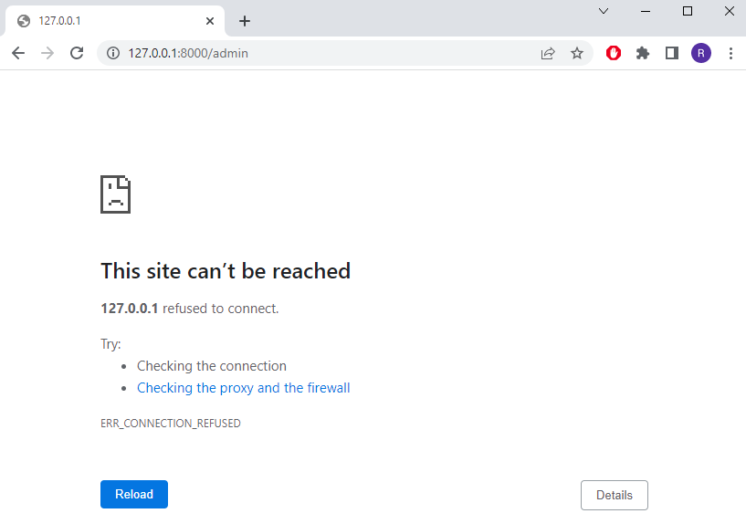

# BOOK CLUB

<!-- Book reviews from:
https://www.goodreads.com/

tutor support for:
- template tags 
- load static

bugs:
- 

issues:
- migrade from sqlite to portgresql -->

For my Milestone Project #4 on Code Institute's Diploma in Software Developement course I have created a blog, called Book Club. The blog is used to post reviews about books. All users can read the preview of the reviews on the main page and then be redirected to another page with the full review clicking on the 'Read more' button. If the user is registered and currently logged in, he can have access to create a new post for the blog or edit an existing one.  

You can check the blog clicking HERE

[ PHOTO ]

## Features

### Code features

* Created in Django using Gitpod.
* Deployed in Heroku for online interaction.
* Lines commented for an easy and clear code understanding.

### User features

* option to register/sign in on the blog clicking on the respective button from the navigation bar on the top left.
* Once registered/logged in, user can interact with the blog, writing a new review post or editing an existing one.
* Option to log out by clicking on the respective button from the navigation bar on the top left.
* Read more button, on botton of every post, giving the user the possibility of reading the full review.
* Home button, on the navigation bar at the top left, bringing the user back to the home page.
* About button, on the navigation bar at the top left and on the sidebar at the left, bringing the user to a new page containing information about how the blog was created.

## Technologies used
* Django
* Gitpod as IDE
* Git for version control
* GitHub to storage files
* Heroku for deployment
* PEP8 for code validation

## Resources
* [Code Institute](https://codeinstitute.net/ie/) - course materials, Slack community and tutor/mentor support
* [Boostrap docs](https://getbootstrap.com/docs/5.2/getting-started/introduction/) - for material support
* [Django central](https://djangocentral.com/) - for inspiration and material support
* [W3 Schools](https://www.w3schools.com/django/) - for material support

## Credits

### Content
* Book reviews taken from [Goodreads](https://www.goodreads.com/) website.

## Testing
Code passed with no errors on PEP8 Validator. You can check it by clicking HERE.

## Bugs/Issues

* Gitignore

When setting up all files and folders I forgot to include the .gitignore. So, when at some stage on my commitments I received and warning email from GitHub about my keys being exposed.

_To Fix: No support needed - I just created a new file, added the necessary content on it and then commit/push to Github._

* Login on Django Admin

When setting the supper user I was having trouble to access the Django Admin page. The url was returning an error message.

_To Fix: Needed support from Tutor - The server was not running. I was told to run the server and use the url *https://8000-rlorimier-bookclub-fa25pzry77q.ws-eu63.gitpod.io/admin/*._

* Hyperlinks not working

Variables counter and times_win - when declared inside the function both were adding 1 only two times and then stopping the counting. I declared them outside the function and used them as global variables within the function and it makes them work properly, adding one at every victory and every time the game was played.

Function keep_playing() - The input was initially with the 'while', with no variables declared to store it. The answer Y would restart the game, however any other letter typed would end it. I created the variable play_again and the if/else statements within the while loop so whatever the user types has a reaction.

Line 150 - I add the input to ask the user Y/N (same as the one on line 142). By doing this, whenever the answer was Y the loop restarted and the question was repeted. The use of 'continue' avoided the duplicated questioning and restarted the game straight away.

ISSUE
You may notice that this repository only contain a few commits. This was not intentional and happened just because the code was initially written in another repository. You can check it by clicking HERE. When deploying the initial project on Heroku it was always returning failure messages. Failure

When contact CI Student Support I was told that was necessary to use the CI template due to important files to be added in order to make the deployment works. That said, a new repository was created. The previous code was copied and past on the new file and the deployment ran with no failure. Deployed

## Creating a Repository and Deploying
The steps to create a new repository:

Logged in my GitHub page and accessed Code Institute GitHub page.
Selected python-essencials-template and clicked in Use This Template.
Created a new repository from the one mentioned above.
On my GitHub Desktop, selected Add and then Clone a repository.
On my Visual Studio Code (VSC), selected Open Folder and then selected the new created folder to start coding.
The steps to commit and push commits:

Every alteration on the files was being saved automatically.
GitHub Desktop is connected with VSC and showns every changes made on the files.
After every significant amount of coding is time for local commits:
On GitHub Desktop, type in a name for the commit and click Commit to Main.
After a work day, the last local commit is done and then click in Push Origim to commit all local commits to GitHub repository.
To Deploy:

Logged in Heroku page and clicked New > Create New App.
Selected app name and region.
On Settings:
Created a Config Var called PORT and setted to 8000.
Added Python and NodeJS buildpacks.
On Deploy:
Conected to my GitHub and searched a repository to conect with.
Clicked Deploy Branch